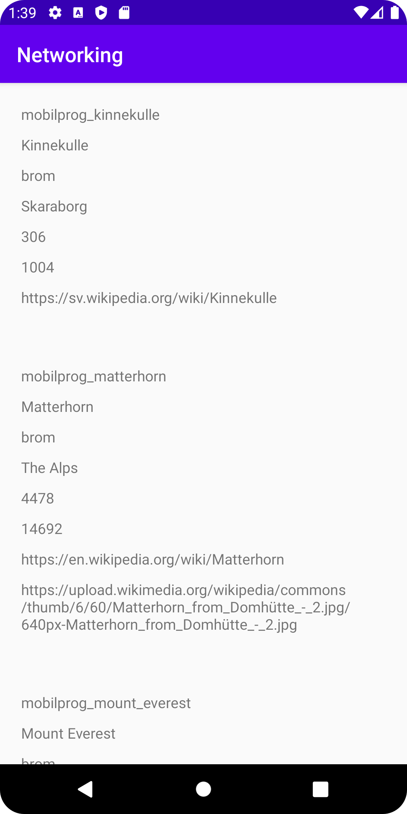

# Assignment 5: Networking

## Layout för Recycler View
Först lades en layout för recycler view till, vilket delvis bestämmer designen för
hur en recycler view ska presenteras. Detta görs i form av XML som syns nedan.
```
    <androidx.recyclerview.widget.RecyclerView
        android:id="@+id/recycler_view"
        android:layout_width="match_parent"
        android:layout_height="match_parent"
        android:layout_marginStart="10dp"
        android:layout_marginTop="10dp"
        app:layout_constraintStart_toStartOf="parent"
        app:layout_constraintTop_toTopOf="parent" />
```
_Figur 1.1 XML för layout av Recycler View_

## Funktionen för Reycler View
En recycler view gör det möjligt att dynamiskt visa innehåll. Det vill säga att presentera data
oberoende av dess längd och storlek. För att skapa en recycler view krävs ett antal olika komponenter,
där de största är en adapter, view holder och en layout manager. Adaptern är den huvudsakliga komponenterna som presenterar
all data medan en view holder tar hand om varje individuellt element medan layout managern arrangerar alla dessa element.

Men först av allt skapades en instans, kod för detta syns nedan.
Man börjar med att skapa de olika variablerna. I fallet för kod nedan
får själva recycler viewn variabeln "myRecyclerView". Sedan skapas adapter:n och slutligen layout manager:.
När detta är gjort länkas recyclerview:n mot ett id i layouten där datan kan presenteras.
Efter det länkas layout managern till den tidigare variabeln som skapades. Sen kopplas adaptern till en klass
och den data vi vill skicka med, i detta fall kan man använda "Tracks" som är en variabel som används som test under implementeringen av recycler viewn eller den senare json datan som kommer behandlas.
Slutligen kopplar vi både adaptern och layout managern till reycler viewn.

```
    RecyclerView myRecyclerView;
    RecyclerView.Adapter myAdapter;
    RecyclerView.LayoutManager myLayoutManager;

    (...)

        // Skapar en recycler view instans
        myRecyclerView = findViewById(R.id.recycler_view);
        // Optimerings parameter
        myRecyclerView.setHasFixedSize(true);
        myLayoutManager = new LinearLayoutManager(this);
        myRecyclerView.setLayoutManager(myLayoutManager);
        myAdapter = new MainAdapter(MountainsA);
        myRecyclerView.setAdapter(myAdapter);

```
_Figur 2.1 Kod för att instansiera Reycler View_

## Reycler View Adapter
När man har instansierat recycler viewn behöver adaptern skapas. Detta görs i en egen klass där
tre huvudsakliga metoder skapas nämligen onCreateViewHolder, onBindViewHolder, getItemCount. Där onCreateViewHolder just skapar
en view holder så länge ingen annan existerar. Och onBindViewHolder tar hand om de olika vyerna som skapas, en recycler view har i
uppgift att vara ett mer effektiv sett att hantera vyer genom att återanvända dem och inte visa alla samtidigt, just
för att spara minne, och denna metod hanterar dessa vyer. Metoden getItemCount är simpel och berättar just hur många objekt som finns.
I dessa olika metoder kan man sedan specificera vad som exakt ska hända men som syns i koden nedan (se där kod kommentarer).

```
    @NonNull
    @Override
    public MainAdapter.ViewHolder onCreateViewHolder(@NonNull ViewGroup parent, int viewType) {
        // Skapar en ny view för list_items som används för att presentera innehåller i recycler view
        View view = LayoutInflater.from(parent.getContext()).inflate(R.layout.list_items, parent, false);
        return new ViewHolder(view);
    }

    @Override
    public void onBindViewHolder(@NonNull MainAdapter.ViewHolder holder, int position) {
        // Hämtar varje element i array
        holder.textD.setText(Tracks.get(position));
    }

    @Override
    public int getItemCount() {
        return Tracks.size();
    }
```
_Figur 3.1 Metoder för Recycler View_

I denna adapter klas behöver man i detta fallet också berätta vilken data som ska finnas i recycler view. I detta fallet vill man
ha den array som kommer att skapas i activity main, detta syns i kod nedan.

````
    // Skapar array som kommer från main activity
    ArrayList<String> Tracks;
    public MainAdapter(ArrayList<String> tracks) {
        Tracks = tracks;
    }
````
_Figur 3.2 Kod för att länka array_

Slutligen så skapas en view holder som kopplas mot ett id för var datan kan presenteras, detta syns i kod nedan.

````
    public class ViewHolder extends RecyclerView.ViewHolder {

        public TextView textD;

        public ViewHolder(@NonNull View itemView) {
            super(itemView);

            // Kopplar variabel mot id i en layout
            textD = itemView.findViewById(R.id.display_text);
        }
    }
````
_Figur 3.3 Kod för View Holder_

## JSON data
För att java ska kunna hantera JSON data måste de olika array elementen kopplas på klasser. Därför skapas ytterligare en klass som heter mountain som
sparar alla värden i strängar (se figur 4.1), sedan kan man med hjälp av dessa klasser hämta den data man vill ha. I koden som syns nedan skapas ett antal privata strängar
som sedan med hjälp av olika getters kan skicka denna data till de funktioner som kallar på den. Här finns också en funktion för varje getter som behandlar null
värden. Eftersom inte null beskrivs per automatik ges null värdet om strängen inte innehåller något alls. Sedan kan man i ta bort alla värden i arrayen
som har noll, vilket i detta fallet görs i main och syns lite längre ner (figur 4.2).

```
public class Mountain {
    private String ID;
    private String name;
    private String type;
    private String company;
    private String location;
    private String category;
    private String size;
    private String cost;
    private Auxdata auxdata;

    public String getName() {
        // Om tomt skickas null annars hela oridinarie värde
        if (name.equals("")) {
            return null;
        }
        else {
            return name;
        }
    }

    public String getID() {
        if (ID.equals("")) {
            return null;
        }
        else {
            return ID;
        }
    }
  (...)
}
```
_Figur 4.1 Kod för getters_

```
        // Tar bort alla null värden från array
        while (MountainsA.remove(null)) {}
```
_Figur 4.2 Kod för att ta bort null värden_

## GSON
I tidigare steg skapades klass för att hantera JSON data men den typ av Recycler View som skapats kan inte hantera en JSON array utan därför måste
denna omvandlas till en java Arraylist. Detta görs med hjälp av exempelvis gson, som använts i detta fall. Kod nedan visar hur en gson instans skapas
och kopplas till den tidigare mountain klassen som skapades samt json datastrukturer som parsats med tidigare redan implementerade funktioner.
Sedan kan man hämta datan från mountain klassen som nu ges i form av strängar, och med hjälp av en for loop som körs av JSON arrayens längd kan vi
skapa en ny java Arraylist från dessa strängar. Sedan matar man in denna nya array in i adaptern istället för tidigare Tracks arrayen.

```
        // Skapar gson instans från json fil och mountain klass
        Gson gson = new Gson();
        mountains = gson.fromJson(json, Mountain[].class);

        MountainsA = new ArrayList<>();

        // Funkation som lägger till varje gson objekt i en array
        for (int i = 0; i < mountains.length; i++) {
            String id = mountains[i].getID();
            MountainsA.add(id);
            String name = mountains[i].getName();
            MountainsA.add(name);
            String type = mountains[i].getType();
            MountainsA.add(type);
            String company = mountains[i].getCompany();
            MountainsA.add(company);
            String location = mountains[i].getLocation();
            MountainsA.add(location);
            String category = mountains[i].getCategory();
            MountainsA.add(category);
            String size = mountains[i].getSize();
            MountainsA.add(size);
            String cost = mountains[i].getCost();
            MountainsA.add(cost);
            String wiki = mountains[i].getAuxdata().getWiki();
            MountainsA.add(wiki);
            String img = mountains[i].getAuxdata().getImg();
            MountainsA.add(img);
            MountainsA.add("\n");
        }
```
_Figur 5.1 Kod för att skapa en GSON och omvandla denna data till java Arraylist_

